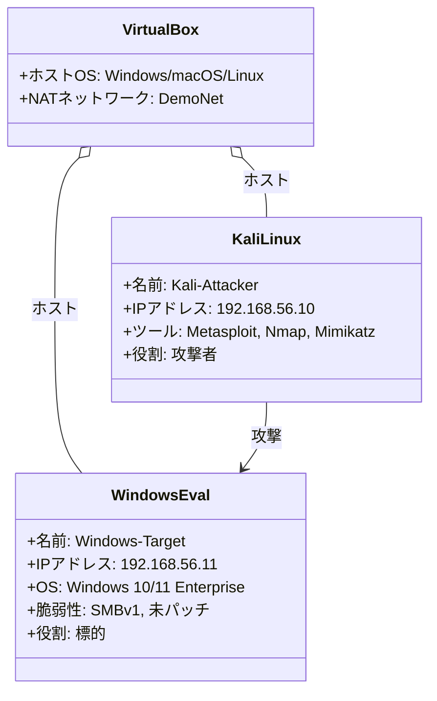
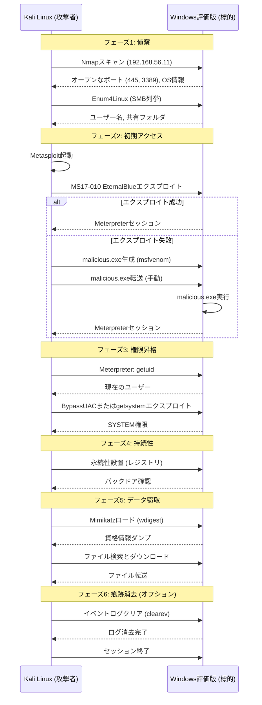

# APT Demo Explanation

```mermaid
classDiagram
    class VirtualBox {
        +ホストOS: Windows/macOS/Linux
        +NATネットワーク: DemoNet
    }
    class KaliLinux {
        +名前: Kali-Attacker
        +IPアドレス: 192.168.56.10
        +ツール: Metasploit, Nmap, Mimikatz
        +役割: 攻撃者
    }
    class WindowsEval {
        +名前: Windows-Target
        +IPアドレス: 192.168.56.11
        +OS: Windows 10/11 Enterprise
        +脆弱性: SMBv1, 未パッチ
        +役割: 標的
    }

    VirtualBox o-- KaliLinux : ホスト
    VirtualBox o-- WindowsEval : ホスト
    KaliLinux --> WindowsEval : 攻撃
```

```mermaid
sequenceDiagram
    participant K as Kali Linux (攻撃者)
    participant W as Windows評価版 (標的)

    Note over K,W: フェーズ1: 偵察
    K->>W: Nmapスキャン (192.168.56.11)
    W-->>K: オープンなポート (445, 3389), OS情報
    K->>W: Enum4Linux (SMB列挙)
    W-->>K: ユーザー名, 共有フォルダ

    Note over K,W: フェーズ2: 初期アクセス
    K->>K: Metasploit起動
    K->>W: MS17-010 EternalBlueエクスプロイト
    alt エクスプロイト成功
        W-->>K: Meterpreterセッション
    else エクスプロイト失敗
        K->>W: malicious.exe生成 (msfvenom)
        K->>W: malicious.exe転送 (手動)
        W->>W: malicious.exe実行
        W-->>K: Meterpreterセッション
    end

    Note over K,W: フェーズ3: 権限昇格
    K->>W: Meterpreter: getuid
    W-->>K: 現在のユーザー
    K->>W: BypassUACまたはgetsystemエクスプロイト
    W-->>K: SYSTEM権限

    Note over K,W: フェーズ4: 持続性
    K->>W: 永続性設置 (レジストリ)
    W-->>K: バックドア確認

    Note over K,W: フェーズ5: データ窃取
    K->>W: Mimikatzロード (wdigest)
    W-->>K: 資格情報ダンプ
    K->>W: ファイル検索とダウンロード
    W-->>K: ファイル転送

    Note over K,W: フェーズ6: 痕跡消去 (オプション)
    K->>W: イベントログクリア (clearev)
    W-->>K: ログ消去完了
    K->>W: セッション終了
```
