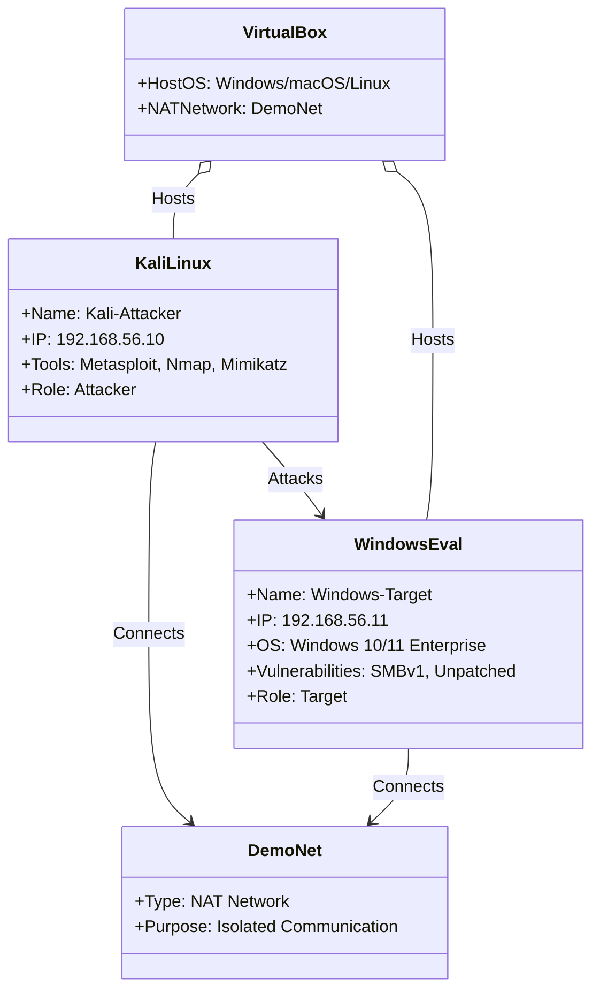
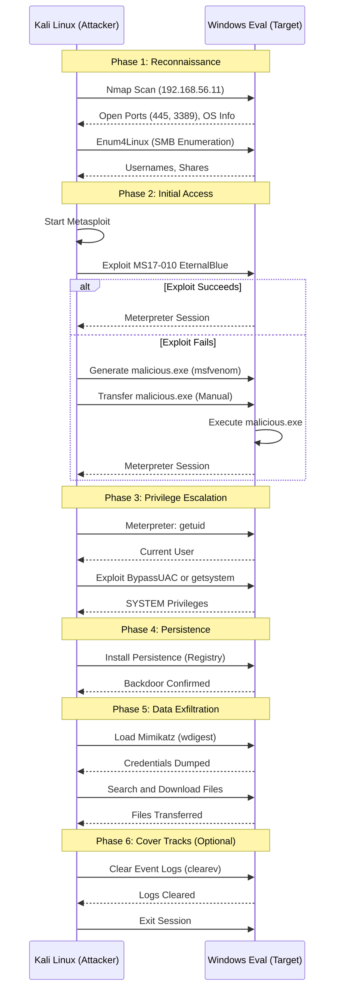

# APT Demo Explanation

```mermaid
classDiagram
    class VirtualBox {
        +HostOS: Windows/macOS/Linux
        +NATNetwork: DemoNet
    }
    class KaliLinux {
        +Name: Kali-Attacker
        +IP: 192.168.56.10
        +Tools: Metasploit, Nmap, Mimikatz
        +Role: Attacker
    }
    class WindowsEval {
        +Name: Windows-Target
        +IP: 192.168.56.11
        +OS: Windows 10/11 Enterprise
        +Vulnerabilities: SMBv1, Unpatched
        +Role: Target
    }
    class DemoNet {
        +Type: NAT Network
        +Purpose: Isolated Communication
    }

    VirtualBox o-- KaliLinux : Hosts
    VirtualBox o-- WindowsEval : Hosts
    KaliLinux --> DemoNet : Connects
    WindowsEval --> DemoNet : Connects
    KaliLinux --> WindowsEval : Attacks
```

```mermaid
sequenceDiagram
    participant K as Kali Linux (Attacker)
    participant W as Windows Eval (Target)

    Note over K,W: Phase 1: Reconnaissance
    K->>W: Nmap Scan (192.168.56.11)
    W-->>K: Open Ports (445, 3389), OS Info
    K->>W: Enum4Linux (SMB Enumeration)
    W-->>K: Usernames, Shares

    Note over K,W: Phase 2: Initial Access
    K->>K: Start Metasploit
    K->>W: Exploit MS17-010 EternalBlue
    alt Exploit Succeeds
        W-->>K: Meterpreter Session
    else Exploit Fails
        K->>W: Generate malicious.exe (msfvenom)
        K->>W: Transfer malicious.exe (Manual)
        W->>W: Execute malicious.exe
        W-->>K: Meterpreter Session
    end

    Note over K,W: Phase 3: Privilege Escalation
    K->>W: Meterpreter: getuid
    W-->>K: Current User
    K->>W: Exploit BypassUAC or getsystem
    W-->>K: SYSTEM Privileges

    Note over K,W: Phase 4: Persistence
    K->>W: Install Persistence (Registry)
    W-->>K: Backdoor Confirmed

    Note over K,W: Phase 5: Data Exfiltration
    K->>W: Load Mimikatz (wdigest)
    W-->>K: Credentials Dumped
    K->>W: Search and Download Files
    W-->>K: Files Transferred

    Note over K,W: Phase 6: Cover Tracks (Optional)
    K->>W: Clear Event Logs (clearev)
    W-->>K: Logs Cleared
    K->>W: Exit Session
```
